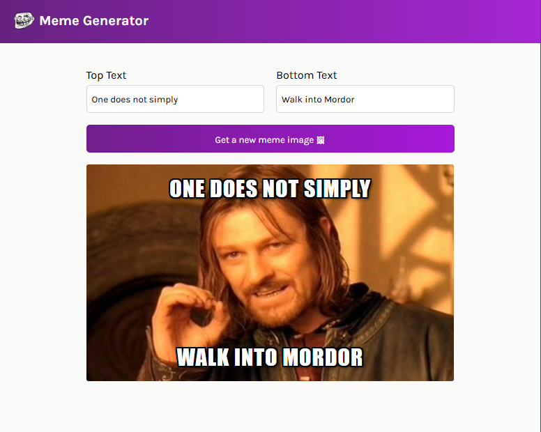

# Meme Generator


An interactive meme generator built with React and Vite.  
Users can enter custom top and bottom text and generate random meme images fetched from an external API.

---

## 🌐 Live Demo

🔗 https://meme-gen-app-react.netlify.app/

The deployed version is hosted on Netlify and automatically updates on redeployment.

---

## 📸 Preview



---

## 🚀 Features

- Two controlled input fields:
  - Top meme text
  - Bottom meme text
- Random meme image generation
- External API integration
- Real-time text overlay rendering
- Responsive layout

---

## 🛠 Tech Stack

Frontend:
- React
- JavaScript
- Vite

API:
- Imgflip Meme API  
  https://api.imgflip.com/get_memes

Deployment:
- Netlify

---

## ⚙️ Application Flow

1. On initial render, the application fetches meme templates from:
   https://api.imgflip.com/get_memes

2. The API returns a list of meme image URLs.

3. When the user clicks **"Get a new meme image"**:
   - A random meme is selected from the fetched list
   - The displayed image updates

4. The text inputs dynamically update the meme overlay using React state.

---

## 📦 Installation & Setup

Clone the repository:

```bash
git clone https://github.com/ahmed-skaik/meme-generator-react.git
